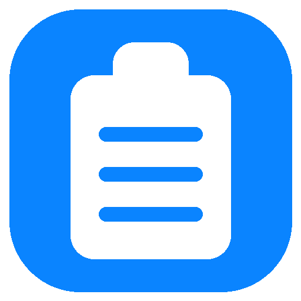
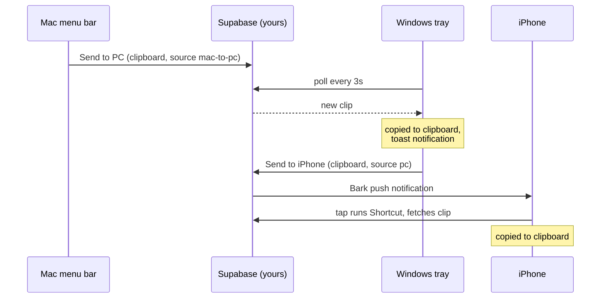

<p align="center">
  
</p>

<h1 align="center">ClipBridge</h1>

<p align="center"><b>A shared clipboard for your Windows PC, your Mac, and your iPhone.</b><br>
Copy on one device, press one button, and it is on the other device with a notification. That's it.</p>

---

Every clipboard sync product wants an account, a subscription, or your data on someone else's server. ClipBridge is the opposite: two tiny Python apps, one in the Windows system tray and one in the Mac menu bar, talking through a free Supabase table that you own. No accounts, no Electron, no background daemons you can't see. The whole thing is a few hundred lines you can read in one sitting.

## What you get

* **Windows tray app.** Lives in the taskbar corner. Left click sends your clipboard straight to the Mac. Right click for the menu: send to iPhone, fetch the latest clip, or toggle auto fetch.
* **Mac menu bar app.** A native clipboard icon in the menu bar. Left click sends your clipboard straight to the PC. Right click for the menu.
* **Instant sends.** Every send pushes whatever is on your clipboard the moment you click. No dialog, no paste step, no extra clicks.
* **Instant receives.** Auto fetch polls quietly in the background. When a clip arrives it lands directly on your clipboard and you get a native notification telling you what it was and where it came from.
* **Selective by design.** Nothing syncs until you press send. Your clipboard is not streamed anywhere; only the clips you choose to share ever leave the machine.
* **iPhone too (optional).** A database trigger pings your phone through the free Bark app, and one tap runs an iOS Shortcut that pulls the clip onto your iPhone clipboard. Sending from the phone is a Shortcut as well.
* **Voice notes (optional).** Point either client at a tiny Cloudflare Worker and a "Record Note" item appears. On the Mac a global hotkey (default ctrl+alt+r) toggles recording from anywhere: press it, speak, press it again, and the transcript is on your clipboard a moment later. Silences are truncated before upload, and long recordings are chopped at quiet moments and transcribed in parallel, so even a long note comes back fast. On Windows the transcript is also pushed to your other devices; on the Mac it stays local until you choose to send it.

## How it works

One table, three clients, and a `source` field that says who a clip is for. Clips expire from a rolling buffer of 50 rows, so the table never grows.



Both desktop clients poll with a seeded cursor, so launching an app never replays an old clip onto your clipboard, and the Windows poll loop is hardened against the clipboard being momentarily locked by another app.

## Setup

### 1. The backend (five minutes, free)

1. Create a project at [supabase.com](https://supabase.com).
2. Open the SQL editor and run [`supabase/schema.sql`](supabase/schema.sql).
3. Copy your project URL and anon key from Project Settings, then create your config:

```bash
mkdir -p ~/.clipbridge
cp config.example.json ~/.clipbridge/config.json
# edit in your supabase_url and supabase_anon_key
```

Do the same on each machine. Treat the anon key like a password: anyone who has it can read the clips you share.

### 2. Mac

```bash
cd mac
./build.sh --install
```

That builds `ClipBridge.app`, installs it to /Applications, and launches it. Add it to your Login Items if you want it always on. To iterate without building, `python3 -m venv .venv && .venv/bin/pip install -r requirements.txt && .venv/bin/python3 clipbridge.py`.

### 3. Windows

```powershell
pip install -r windows\requirements.txt
pythonw windows\clipbridge.pyw
```

To start it with Windows, put a shortcut to `clipbridge.pyw` in `shell:startup`.

### 4. iPhone (optional)

1. Install [Bark](https://apps.apple.com/app/bark-customed-notifications/id1403753865) and copy your device key.
2. In `supabase/schema.sql`, uncomment the Bark block of the trigger, paste your key, and rerun the function block in the SQL editor. Enable the `pg_net` extension.
3. Create a Shortcut named "PC Transcribe" that fetches the latest clip from the Supabase REST API and copies it to the clipboard. The URL shape is in the schema file's comments.

Now "Send to iPhone" on the PC rings your phone, and one tap puts the text on your iPhone clipboard.

### 5. Voice notes (optional)

Deploy [`worker/transcribe-worker.js`](worker/transcribe-worker.js) to Cloudflare Workers with a `GROQ_API_KEY` secret, put the worker URL in your config as `transcribe_worker_url`, and restart the clients. A "Record Note" item appears in both menus, and on the Mac the global hotkey works too.

The audio pipeline (in [`shared/noteproc.py`](shared/noteproc.py)) trims silences before upload, splits anything over three minutes into pieces cut at the quietest nearby moment so words are never sliced, transcribes the pieces in parallel, and retries transient failures with backoff.

Mac permissions: the first recording asks for microphone access, and that is the only permission involved. The hotkey registers through the system hotkey API (the one Spotlight uses), so it needs no Input Monitoring or Accessibility access and works in every app, Terminal included. While recording the menu bar icon turns into a red dot; while transcribing, an ellipsis.

## Configuration

`~/.clipbridge/config.json` on both platforms (or `config.json` in the repo root):

| Key | Required | Meaning |
|---|---|---|
| `supabase_url` | yes | your Supabase project URL |
| `supabase_anon_key` | yes | your Supabase anon key |
| `poll_seconds` | no | auto fetch interval, default 3 |
| `transcribe_worker_url` | no | enables Record Note on both clients |
| `record_hotkey` | no | Mac recording toggle, default `<ctrl>+<alt>+r` |

## Privacy

Your clips live in your own Supabase project and nowhere else. The rolling buffer keeps only the 50 most recent, each row carries a 24 hour expiry, and nothing is sent anywhere until you press send.

## License

[MIT](LICENSE)
