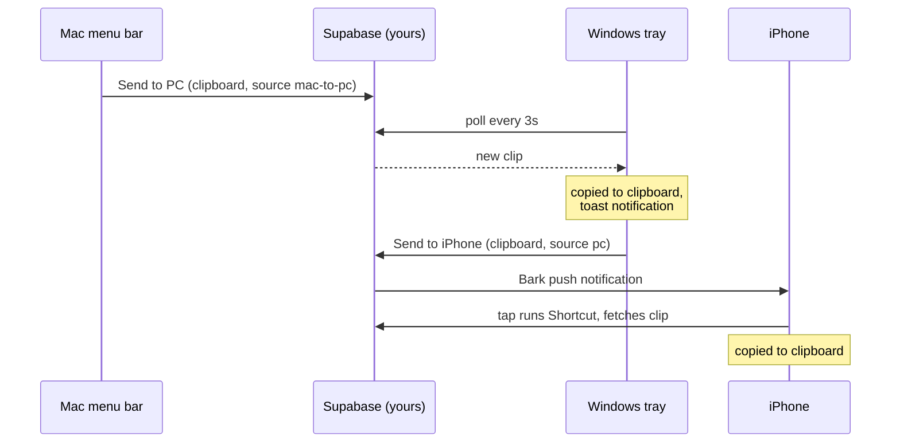

<p align="center">
  
</p>

<h1 align="center">ClipBridge</h1>

<p align="center"><b>A shared clipboard for your Windows PC, your Mac, and your iPhone.</b><br>
Copy on one device, press one button, and it is on the other device with a notification. That's it.</p>

---

Every clipboard sync product wants an account, a subscription, or your data on someone else's server. ClipBridge is the opposite: two tiny Python apps, one in the Windows system tray and one in the Mac menu bar, talking through a free Supabase table that you own. No accounts, no Electron, no background daemons you can't see. The whole thing is a few hundred lines you can read in one sitting.

## What you get

* **Windows tray app.** Lives in the taskbar corner. Left click sends your clipboard straight to the Mac. Right click for the menu: send to iPhone, fetch the latest clip, or toggle auto fetch.
* **Mac menu bar app.** A native clipboard icon in the menu bar. Left click sends your clipboard straight to the PC. Right click for the menu.
* **Instant sends.** Every send pushes whatever is on your clipboard the moment you click. No dialog, no paste step, no extra clicks.
* **Instant receives.** Auto fetch polls quietly in the background. When a clip arrives it lands directly on your clipboard and you get a native notification telling you what it was and where it came from.
* **Selective by design.** Nothing syncs until you press send. Your clipboard is not streamed anywhere; only the clips you choose to share ever leave the machine.
* **iPhone too (optional).** A database trigger pings your phone through the free Bark app, and one tap runs an iOS Shortcut that pulls the clip onto your iPhone clipboard. Sending from the phone is a Shortcut as well.
* **Voice notes (optional).** A "Record Note" item, with transcription on the Mac itself: whisper.cpp runs the same model the hosted worker does, so the text is identical and a poor connection cannot hold it up. Windows, and a Mac without whisper.cpp installed, point at a tiny Cloudflare Worker instead. On the Mac a global hotkey (default ctrl+alt+space) toggles recording from anywhere: press it, speak, press it again, and the transcript is on your clipboard a moment later. Notes can overlap: press it again while one is still transcribing and the next note starts, with its pill under the pointer and the older ones stacked beneath it. Transcripts reach the clipboard in the order they were recorded, and each one waits until you have pasted the one before it. Recording is written straight to disk as it happens, so a note survives a crash, or a transcription that fails, and is retried later. On the worker path, long recordings are chopped at quiet moments and uploaded in parallel, so even a long note comes back fast. On Windows the transcript is also pushed to your other devices; on the Mac it stays local until you choose to send it. The Mac keeps the last five notes under "Recent Notes" in the menu, listed by day and time, and clicking one puts its transcript back on the clipboard.

## How it works

One table, three clients, and a `source` field that says who a clip is for. A clip is readable for fifteen minutes and then it is not, and a rolling buffer of 50 rows keeps the table from growing.



Both desktop clients fix a cursor from the table before they start polling, so launching an app never replays an old clip onto your clipboard. An empty table is a valid starting point, which matters because clips expire after fifteen minutes and empty is the usual state. The Windows poll loop is also hardened against the clipboard being momentarily locked by another app.

## Setup

### 1. The backend (five minutes, free)

1. Create a project at [supabase.com](https://supabase.com).
2. Open the SQL editor and run [`supabase/schema.sql`](supabase/schema.sql).
3. Copy your project URL and anon key from Project Settings, then create your config:

```bash
mkdir -p ~/.clipbridge
cp config.example.json ~/.clipbridge/config.json
# edit in your supabase_url and supabase_anon_key
```

Do the same on each machine. Treat the anon key like a password: anyone who has it can read the clips you share.

### 2. Mac

```bash
cd mac
./build.sh --install
```

That builds `ClipBridge.app`, installs it to /Applications, and launches it. To iterate without building, `python3 -m venv .venv && .venv/bin/pip install -r requirements.txt && .venv/bin/python3 clipbridge.py`.

It starts at login, and "Open at Login" in the menu turns that off. The checkmark reports `SMAppService` rather than the preference behind it, because the two come apart on every install: the registration is bound to the bundle, and `build.sh --install` deletes and replaces the bundle. What is stored, in `~/.clipbridge/prefs.json`, is the intent, and the app restates it at launch, which is what puts the registration back. A dash instead of a checkmark means the item was switched off in System Settings > General > Login Items; clicking it then opens that pane, because registering again would not lift it. Running from source, the item is greyed: `mainAppService` would otherwise register the Python framework's own `Python.app`, so [`mac/loginitem.py`](mac/loginitem.py) checks the bundle identifier before touching anything.

`login_item` in `~/.clipbridge/mac_debug.log` says which of those four it was at the last launch. That is the cheap way to check it: the system's own record is in `sfltool dumpbtm`, which needs root and asks for a password every time.

### 3. Windows

```powershell
pip install -r windows\requirements.txt
pythonw windows\clipbridge.pyw
```

To start it with Windows, put a shortcut to `clipbridge.pyw` in `shell:startup`.

### 4. iPhone (optional)

1. Install [Bark](https://apps.apple.com/app/bark-customed-notifications/id1403753865) and copy your device key.
2. In `supabase/schema.sql`, uncomment the Bark block of the trigger, paste your key, and rerun the function block in the SQL editor. Enable the `pg_net` extension.
3. Create a Shortcut named "PC Transcribe" that fetches the latest clip from the Supabase REST API and copies it to the clipboard. The URL shape is in the schema file's comments.

Now "Send to iPhone" on the PC rings your phone, and one tap puts the text on your iPhone clipboard.

### 5. Voice notes (optional)

On the Mac, two things and no account:

```bash
brew install whisper-cpp
mkdir -p ~/.clipbridge/models
curl -L -o ~/.clipbridge/models/ggml-large-v3-turbo.bin \
  https://huggingface.co/ggerganov/whisper.cpp/resolve/main/ggml-large-v3-turbo.bin
```

Restart ClipBridge and "Record Note" appears, along with the global hotkey. Nothing is uploaded and nothing needs a network. `~/.cache/lecpipe/models` is checked as well, so a copy of the model already there is used rather than fetched twice.

For Windows, or for a Mac where you would rather not keep 1.6 GB of weights, deploy [`worker/transcribe-worker.js`](worker/transcribe-worker.js) to Cloudflare Workers with a `GROQ_API_KEY` secret and put the worker URL in your config as `transcribe_worker_url`. The Mac uses it only when whisper.cpp or the model is missing.

The two paths run the same model, `whisper-large-v3-turbo`, so they return the same text. What differs is everything around it. Local, on an M3 Pro, a three minute note comes back in about seven seconds and works on a plane. The text whisper has already produced is fed back to it as context for the next window, which is how it gets stuck repeating a sentence until the note ends, losing everything said under the repetition, so that context is capped (`MAX_CONTEXT` in `shared/localasr.py`) at enough for a sentence to cross a window boundary and not enough for a loop to sustain itself. Through the worker, [`shared/noteproc.py`](shared/noteproc.py) splits anything over a minute into pieces cut at the quietest nearby moment so words are never sliced, uploads the pieces in parallel, and retries transient failures with backoff.

A finished note is kept as a pair in `~/.clipbridge/notes`: the audio it was spoken into and a `.txt` of the same name holding what came back. The Mac menu's "Recent Notes" submenu lists the five most recent by day and time, and clicking one copies its transcript. When the text is missing, which is the case for a note recorded before this existed and for one whose transcript never landed, the audio is transcribed again and the text is saved that time. Only five notes survive: filing a sixth deletes the oldest, audio and transcript together.

Mac permissions: the first recording asks for microphone access. The hotkey registers through the system hotkey API (the one Spotlight uses), so it needs no Input Monitoring access and works in every app, Terminal included. Pinning (below) needs Accessibility, and nothing else does.

Pinning a note to a text field: after stopping a note, press the pin hotkey (default ctrl+alt+v, `pin_hotkey` in the config) in a text field, or control option click one. If the transcript already exists, it is typed at the cursor and that is all. If it is still transcribing, ClipBridge types a marker such as `⟦note 1⟧` at the cursor. Keep typing around it, or go elsewhere. When the transcript comes back it replaces the marker through the accessibility API, without bringing that app forward, the cursor goes back to where you were typing, and the pill reads "pasted". The pin takes the newest note not yet pasted. If the marker cannot be found or the field will not take the text, the note goes back in the clipboard queue and the pill reads "not pinned, copied to clipboard".

Gecko browsers (Zen, Firefox and their forks) are handled differently on purpose. Their handler for the accessibility call that replaces selected text passes a length where an end offset belongs, so it deletes everything typed before the marker and then fails the insert. In those browsers the marker is selected through accessibility, the selection is read back, and the transcript is typed over it as keystrokes.

In a terminal (Terminal, iTerm2, Ghostty, Warp, kitty, Alacritty, WezTerm) the marker is swapped with keystrokes. When the transcript arrives and the terminal window is in front, ClipBridge reads the screen text and the cursor position, walks the cursor back to the marker with the left arrow, and checks on screen that the cursor sits right after the marker. Only then does it backspace the marker away, type the transcript, and walk the cursor forward again. This works in a shell and in Claude Code's input box, across wrapped lines. A terminal that does not report its text and cursor (or a window that stays in the background for 90 seconds) keeps the marker, the pill reads "ready for ⟦note 1⟧", and the hook below covers Claude Code. Every pin is written to `~/.clipbridge/pins/<number>.json`, and [`mac/pin_hook.py`](mac/pin_hook.py), registered as a Claude Code `UserPromptSubmit` hook, finds the markers in a sent prompt, waits up to 110 seconds for any still transcribing, and gives Claude each transcript as what its marker stands for. The prompt text is left as typed. `build.sh` signs the app with the Apple Development certificate when there is one, because an ad hoc signature changes on every build and macOS drops the Accessibility grant with it. While recording the menu bar icon turns into a red dot; while transcribing, an ellipsis.

## Configuration

`~/.clipbridge/config.json` on both platforms (or `config.json` in the repo root):

| Key | Required | Meaning |
|---|---|---|
| `supabase_url` | yes | your Supabase project URL |
| `supabase_anon_key` | yes | your Supabase anon key |
| `poll_seconds` | no | auto fetch interval, default 3 |
| `transcribe_worker_url` | no | enables Record Note on Windows, and on a Mac without whisper.cpp |
| `whisper_cli_path` | no | Mac, a whisper.cpp binary somewhere other than the usual places |
| `whisper_model_path` | no | Mac, a model file outside `~/.clipbridge/models` and `~/.cache/lecpipe/models` |
| `whisper_vocabulary` | no | Mac, a sentence or two of names whisper cannot get from the audio (a product name, a person, an acronym), fed in as the initial prompt |
| `record_hotkey` | no | Mac recording toggle, default `<ctrl>+<alt>+r` |

## Privacy

Voice notes recorded on the Mac never leave it: the audio is transcribed on the machine and only the text you choose to send goes anywhere. Your clips live in your own Supabase project and nowhere else. A clip stops being readable fifteen minutes after it is written, the rolling buffer keeps only the 50 most recent, and nothing is sent anywhere until you press send.

## License

[MIT](LICENSE)
